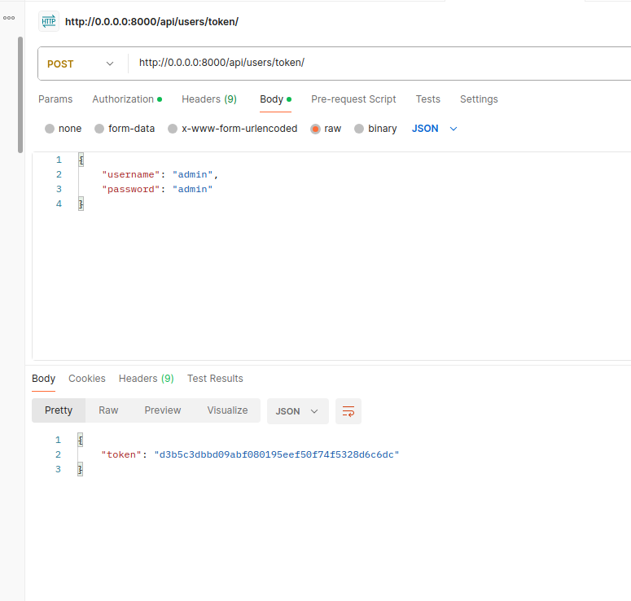
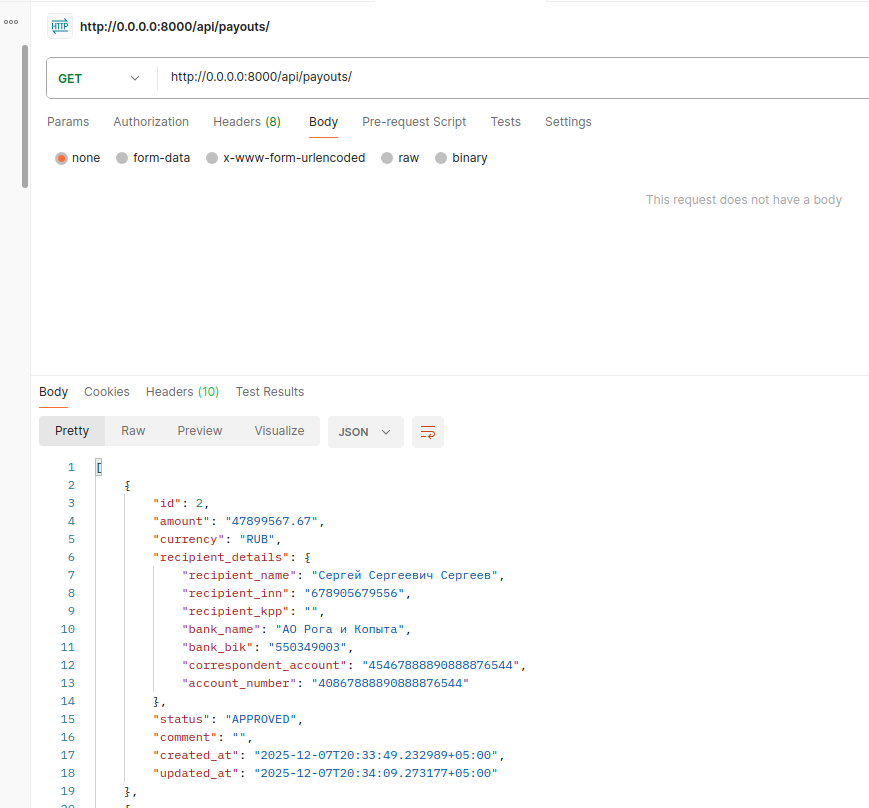
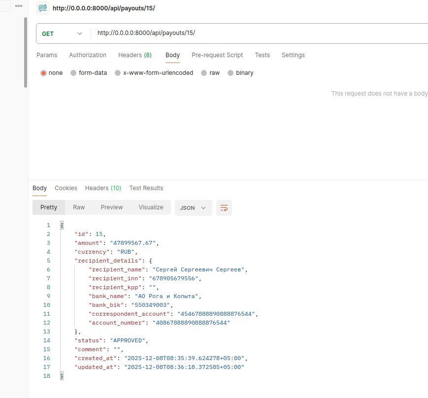
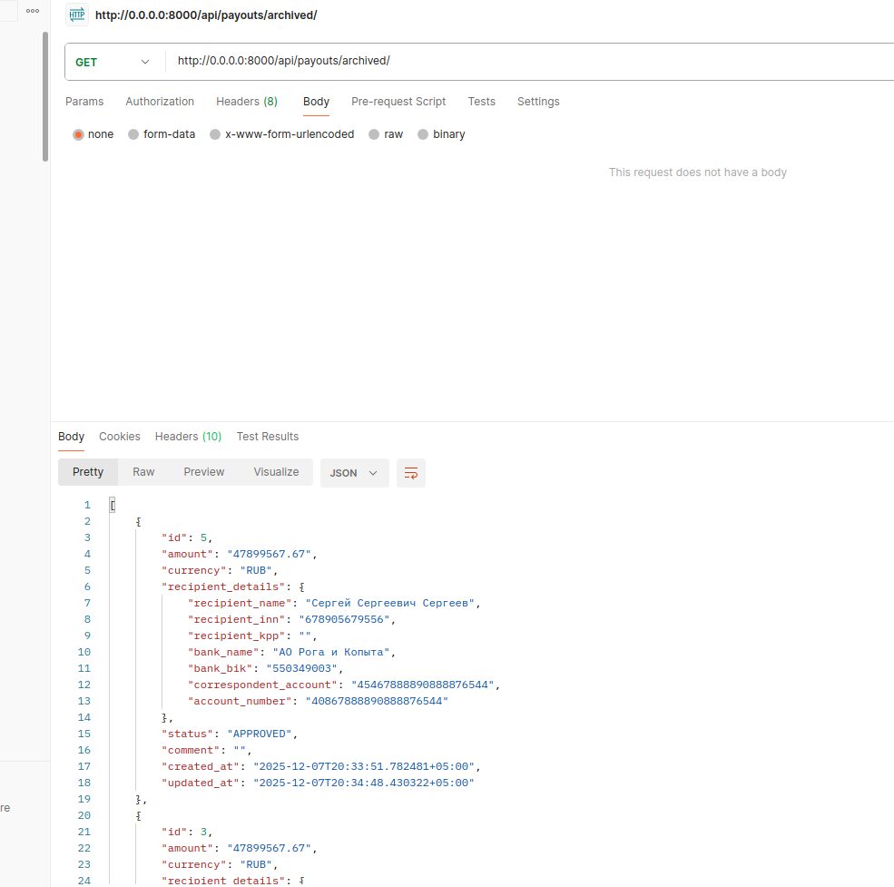
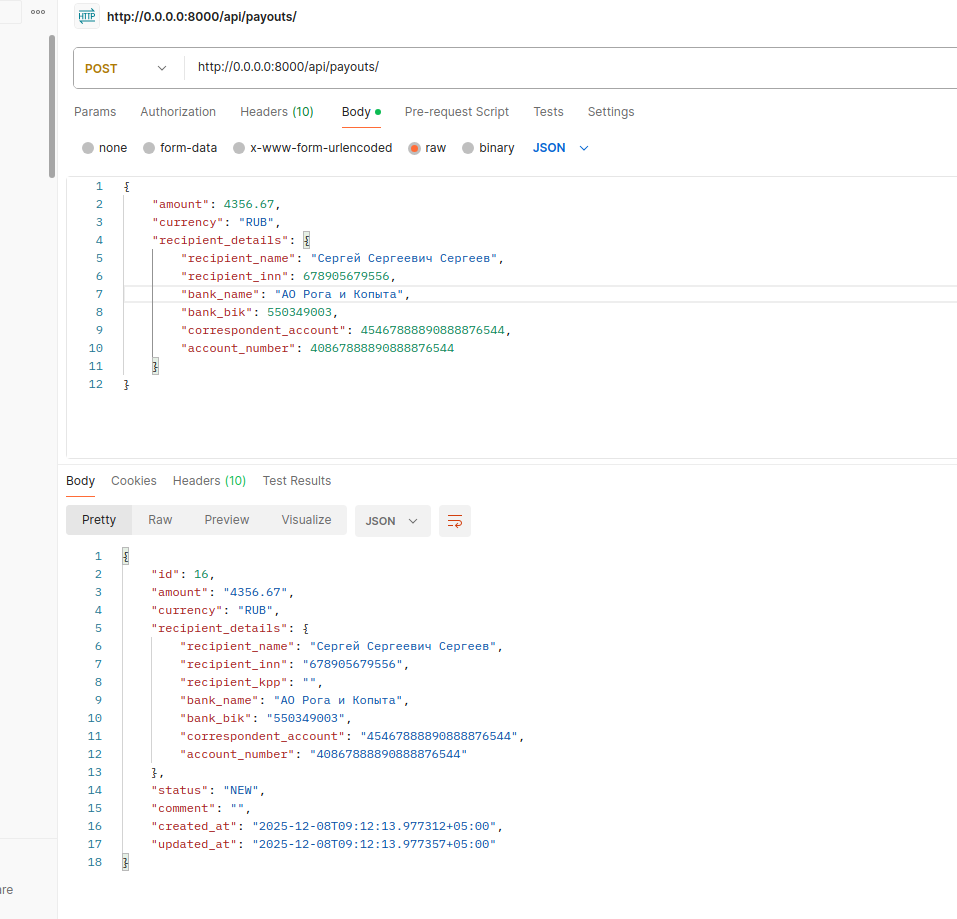
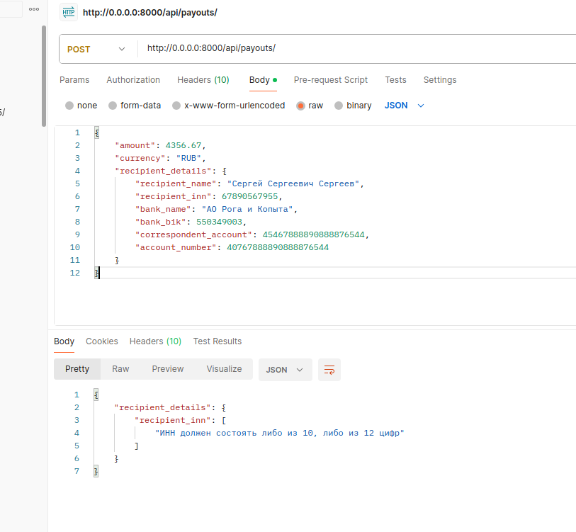
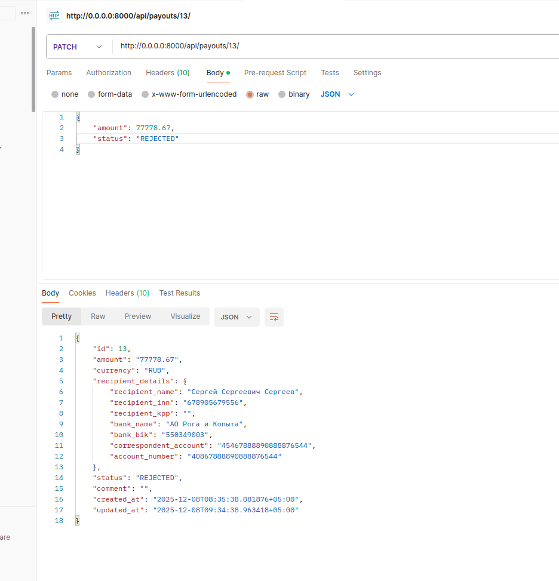
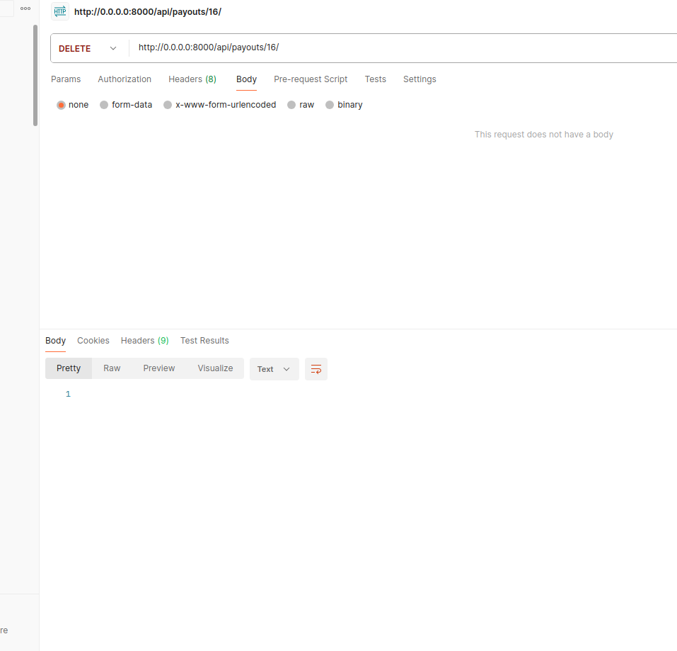
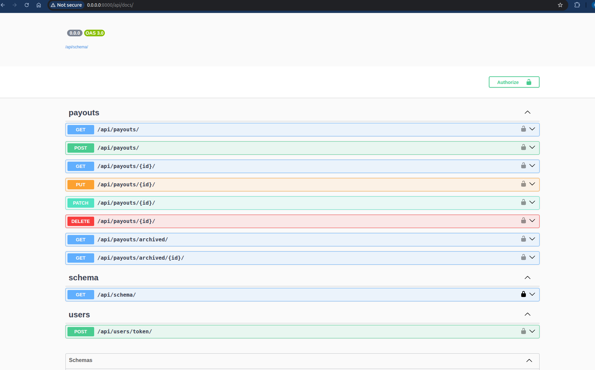
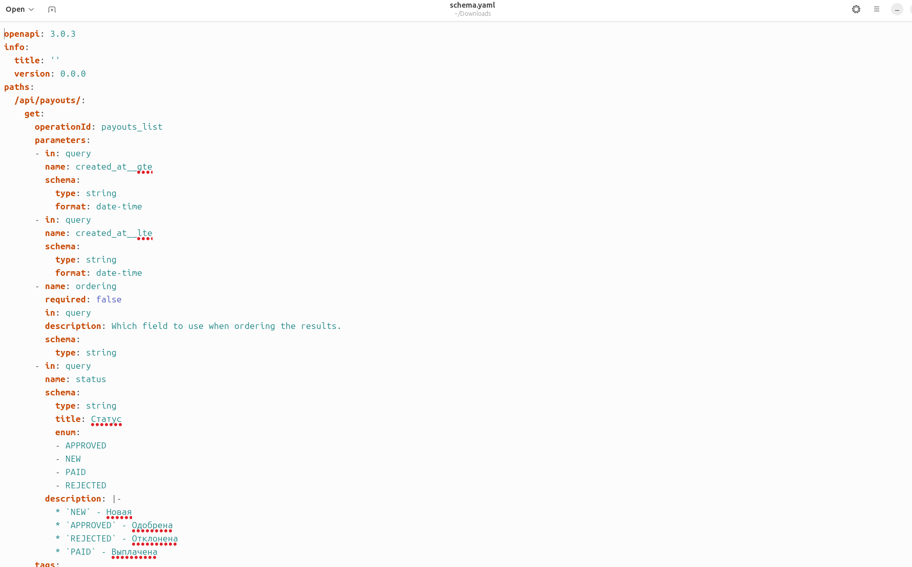

# payments-service-backend

REST-сервис для управления заявками на выплату средств

### Запуск локально:
* Создать файл `.environment` в корне проекта (название переменных взять из `.environment.example`)
* Постороить образ `make build`, затем запустить приложение `make up`
* Накатить миграции `make migrate`
* Просмотреть логи `make logs`
* Запустить тесты `make test` (на работающем приложении)
* Запуск доп воркеров celery `make up-default-workers NUM_WORKERS={число}`

### Деплой:
* каждый сервис упаковывается в отдельный Docker-образ (Django, Redis, Celery, Celery-beat) - `docker compose -f docker-compose.prod.yml build`;
* эти образы закидывают на хост, где и запускаются - `docker compose -f docker-compose.prod.yml up -d`, также используются скрипты в `deploy.sh`, `.migration.sh`;
* Django запускается через gunicorn - `gunicorn payments_service.wsgi:application --bind 0.0.0.0:8000`;
* Воркеры селери запускаются `celery -A payments_service worker -l INFO --concurrency=2`, при необходимости можно запускать с различными очередями `-Q payments`;
* На хосте должны быть установлены `Docker` и `Docker Compose` или `Kubernetes`;
* Файл `.environment` удобно поддерживать через сервис `infiskal`;

## UserFlow:

* Получение токена для созданого пользователя `POST /api/users/token/`

* Просмотр листа активных заявок `GET /api/payouts/`

* Просмотр ретрива активной заявки `GET /api/payouts/{id}/`

* Просмотр архивных заявок `GET /api/payouts/archived/` и `GET /api/payouts/archived/{id}/`

* Создание заявки `POST /api/payouts/` и валидация

* Изменение заявки `PATCH /api/payouts/{id}/`

* Удаление заявки `DELETE /api/payouts/{id}/`

* Просмотр сваггера `GET /api/docs/` и схемы `GET /api/schema/`

